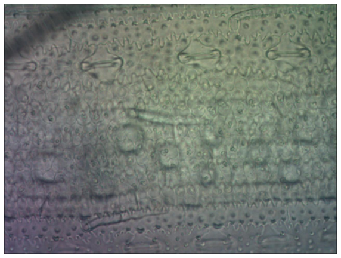
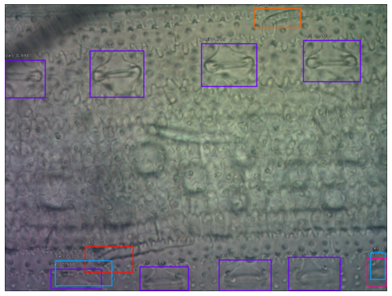

# Stomata detection using retinanet

## Example of the output




Color code represents the confidence score of the match. Dark blue is confidence above 0.9

## Installation

```zsh
pip install git+https://github.com/fizyr/keras-retinanet
git clone {{path to the github repo}}
```

## Setting up data for training

It is important to tweak a couple of things once the repository is cloned
for the training to work smoothly.

For more details please check the specifications in the `keras-retinanet`
repository, here
[https://github.com/fizyr/keras-retinanet#csv-datasets](https://github.com/fizyr/keras-retinanet#csv-datasets)

Namely, the input to use is a csv file that bundles all bounding box
annotations. For this we use this couple of functions ...

*as a note, this annotations were generated using [labelimg](https://github.com/tzutalin/labelImg), but there is usually a way to convert the annotations generated from any software to this csv*

Additional annotation software I would recommend:

1. [labelstudio](https://github.com/heartexlabs/label-studio)
2. [labelimg](https://github.com/tzutalin/labelImg),
3. [labelme](https://github.com/wkentaro/labelme)
4. [opencv's annotation software, cvat](https://github.com/opencv/cvat)

```zsh
# Asuming you are inside the cloned repository
# you can get to the repo by running `cd stomata_detector` after cloning it

$ python ./stomata_detector/annotation/convert.py directory \
  --dir annotations \
  --out_dir csv_annotations

$ python ./stomata_detector/annotation/consolidate_csv.py \
  --csv_dir csv_annotations \
  --out_boxes_csv consolidated_boxes.csv \
  --out_classes_csv consolidated_classes.csv
```

This will generate the `consolidated_boxes.csv` `consolidated_classes.csv`
files, whic have this contents

```zsh
$ head -5 consolidated_boxes.csv consolidated_classes.csv

==> consolidated_boxes.csv <==
16_ad_0297.jpg,213,98,400,222,stoma
16_ad_0297.jpg,566,117,741,231,stoma
16_ad_0297.jpg,683,4,873,110,stoma
16_ad_0297.jpg,1078,15,1267,138,stoma
16_ad_0297.jpg,136,739,334,880,stoma

==> consolidated_classes.csv <==
stoma,0
```

As you can note, the images have no directory... and we need the directory...

We can add the rirectory with the following line of shell script

```zsh
cat consolidated_boxes.csv | \
  sed -e "s+^+/${PWD}/raw_images/+g" > \
  absolute_path_boxes.csv
```

Now the file `absolute_path_boxes.csv` should have the same content but with
the full directory structure.

## Training

We will carry out a pretty basic training on the command line, a more fine
grained tunning can be done internally in python but ...

```zsh
retinanet-train --epochs 5 \
  --steps 2000 \
  --random-transform \
  csv absolute_path_boxes.csv consolidated_classes.csv
```

If you want to know exactly what transforms are being applied to the images during
training, please refer to
[the command line implementation of the training function](https://github.com/fizyr/keras-retinanet/blob/c38d54795ee85722104fd005c04b2240d088b1a2/keras_retinanet/bin/train.py#L235)
... Long story short, it rotates them, squishes them, screws up some of the
contrast and light ... nothing unheard of, data augmentation is good, embrace the
data augmentation.

## Deployment

Once the training is finished, you can use the output model to predict new images.

Not quite though ... the partial models will be saved with a numeral, we need to convert
this model to an inference model.

Since we (implicitly) selected a resnet50 architecture for the model, our models will
be saved inside the `snapshot` directory as `resnet50_csv_{NUMBER_OF_EPOCH}.h5`

So in order to transform the model that results from the 5th epoch, we would run:

```zsh
retinanet-convert-model snapshots/resnet50_csv_05.h5 inference_model.h5
```

Now this model can be used in python by running

```python
from keras_retinanet import models
from keras_retinanet.utils.image import read_image_bgr, preprocess_image, resize_image


# load the model
model = models.load_model(model_path, backbone_name='resnet50')

# load image
image = read_image_bgr(img_path)
image = preprocess_image(image)
image, scale = resize_image(image)

# Infer the bounding boxes and re-scale them
boxes, scores, labels = model.predict_on_batch(image)
boxes /= scale
```

## Citation

## TODO
